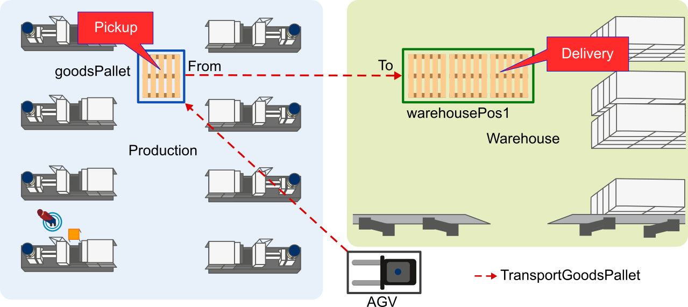

[](https://lotlan.readthedocs.io/en/latest/?badge=latest)


# LoTLan - A Logistc Task Language for Cyber-Physical Production Systems

The Logistic Task Language *(LoTLan)* is a simple, but powerful approach to describe your intralogistic materialflow logic, focusing on cyber-phyiscal production systems (CPPS), in a declarativ manner. LoTLan describes of *what* needs to be done rather than *how* or *who*. Job shop schedulars handling the assignment of tasks to an executing entity.

In our context a materialflow represents a transport, carrying goods from one location (pickup) to another (delivery). 

<center><br />
Figure 1: Logo of LoTLan.

</center>


## Example HelloTransport

The simplest transportation task in *LoTLan* just describes, from which position a container/bin should be picked up and moved to another location. All location as mentioned in the example refer to Figure 1.

```
Location unloadEmptyPallet
    name = "production_goodspallet"     # actuall real name in the warehouse
    type = "Pallet"                     # what type of bin is located at this location
End

Location warehousePos1
    name = "warehouse_pallet_position1" # actuall real name in the warehouse
    type = "Pallet"                     # what type of bin is located at this location    
End

TransportOrderStep loadEmptyPallet
    Location    warehousePos1 
End

TransportOrderStep unloadEmptyPallet
    Location    goodsPallet 
End

Task transportGoodsPallet
    Transport
    From        loadGoodsPallet
    To          unloadGoodsPallet
End
```

<center></center>

Figure 2: Example of LoTlan transportation task called 'transportGoodsPallet', defining a transport from *goodsPallet* to *warehousePos1* in a CPPS.


## Features
LoTLan also supports few more features next to a simple transportation:

- Serial, parallel and concurrent definition of tasks
- Conditional events, e.g. starting a task when a specific event occured
- Concatenation of tasks, also including infinite loops
- Parameterizable actions
- Constraints definition


Further examples can be found in the :books: [documentation](https://firos.readthedocs.io) . It also describes how an automatic or manual load/unload action can be done, utilizing events.


# License

LoTLan is licensed under Apache 2.0.


# Contributors
[Peter Detzner](https://www.github.com/ptrdtznr), [Maximilian Hoerstrup](https://github.com/max-coding), [Dominik Lux](https://github.com/Luxxii)


# Conference

P. Detzner, T. Kirks and J. Jost, "[A Novel Task Language for Natural Interaction in Human-Robot Systems for Warehouse Logistics](https://ieeexplore.ieee.org/document/8845336)", 2019 14th International Conference on Computer Science & Education (ICCSE), Toronto, ON, Canada, 2019, pp. 725-730.