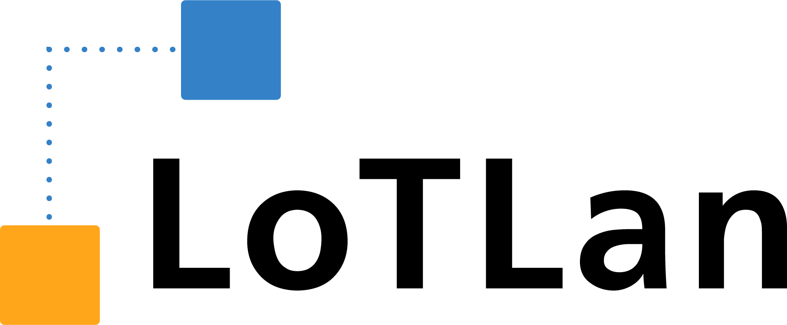

The **Lo**gistic **T**ask **Lan**guage (LoTLan) is a simple, but powerful approach to describe intralogistic materialflow transport logic. A materialflow transport is mainly a transportation task to pickup an item at location A and deliver the item at a dedicated location B. 

***Transport From A To B***

A transport can be executed by a human, by an automated guided vehicle (AGV) or in collaborative mode.