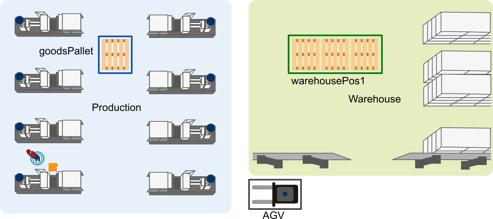

# Instances

An *Instance* is the concrete object of a *Primitive*. Such set of *Instances* can be declared by the user and do not share any data other than the definition of their attributes.

## Location

As an example, two *Instances* of *Location* could be initiated out of the *Primitive* *Location*:

```text
Location goodsPallet
    type = "pallet"
    name = "productionArea_palletPlace"
End

Location warehousePos1
    type = "pallet"
    name = "warehouseArea_pos1"
End
```

The *Instance* *goodsPallet* has two member variables, a *type* and a *value*. The *type* attribute states *what item is located there* and the *value* the *logical name of this location*. Speaking of the example introduced in the [introduction](#Logistic-Task-Language), the formerly shown *Location* *Instances* each define a specific location inside the two areas.


**Figure 1**: Floor plan with Locations *goodsPallet* and *warehousePos1*

The figure shows those locations inside the two areas *Warehouse* and *Production*.


## Event

The *Instances* of an *Event* and *Time* *Primitive* could be defined as following:

```text
Event agvLoadedAtGoodsPallet
    type = "Boolean"
    name = "LightBarrier"
End

Event agvLoadedAtWarehousePos1
    type = "Boolean"
    name = "LightBarrier"
End
```

## Time

Scheduling tasks can be easily done via time-based job scheduler in Unix-like computer operating systems. The following explanation is taken from [Cron](https://en.wikipedia.org/wiki/Cron).

```
# ┌───────────── minute (0 - 59)
# │ ┌───────────── hour (0 - 23)
# │ │ ┌───────────── day of the month (1 - 31)
# │ │ │ ┌───────────── month (1 - 12)
# │ │ │ │ ┌───────────── day of the week (0 - 6) (Sunday to Saturday;
# │ │ │ │ │                                   7 is also Sunday on some systems)
# │ │ │ │ │
# │ │ │ │ │
# * * * * * <command to execute>
``` 

The following example schedules an event each morning at 8:30am.

```text
Time morningBreak
    timing = "30 08 * * *"  # Cron format
End
```

## Constraint

*Constraints* can be used for example in scheduling to have an additional variable which flows into optimization. In this example the cost of a transport, e.g. by an AGV, needs to be less equal than 100.

```text
Constraint costs
    type = "Integer"
End
```
**Syntax**: The syntax of *Primitives* introduced here is complemented by assigning values to the attributes. These values must be enclosed by `"`. The name has to start with a lowercase character. Each attribute also needs to be prefixed with four spaces (or a `\t`).

 