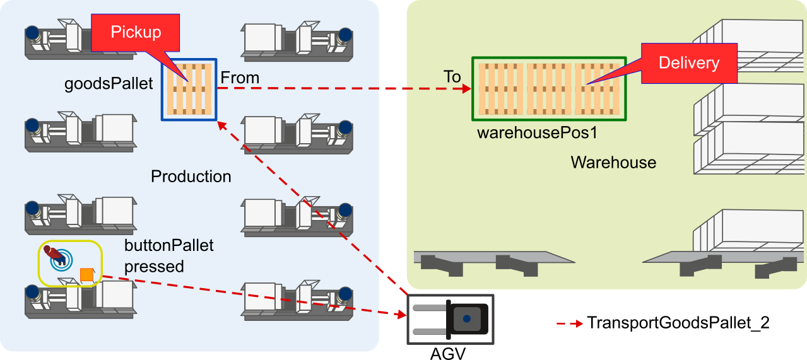
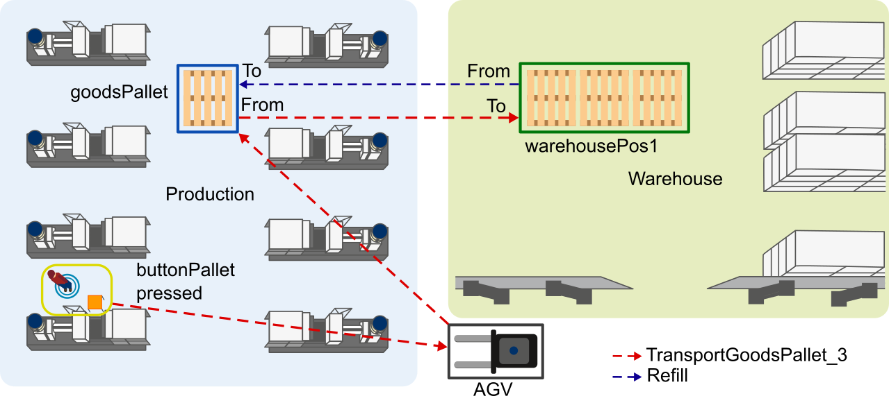

## Tasks

A *Task* orchestrates different *Instances* via operations to result in a logical process flow. Such a *Task* does not need to describe who is going to transport an item - it is important that the item is transported.

Generally speaking a *Task* in *LoTLan* describes that a amount of items should be picked up at some location and be delivered to another location. A *Task* can optionally be triggered by an event, but it can also have follow up *Task* or be repeated. Even an event at the end of a task which is expected can be described. 

```text
Task {name}
    Transport
    From        {transportOrderStep_pickup}
    To          {transportOrderStep_destination}
    TriggeredBy {none|event|time}
    OnDone      {none|followUpTask}
    FinishedBy  {none|event|time}
    Repeat      {none = once|1, ..., n|0 = forever}
    Constraints {none|constraint}
End
```

However, we start with some simple transportation tasks. To simplify this down in the following the simplest structure of a *Task* is build and later on extended with optional functionality. We also use these *Locations* and* TransportOrderSteps* not to inflate this page.


```text
Location goodsPallet
    name = "productionArea_palletPlace"
    type = "pallet"
End

Location warehousePos1
    name = "warehouseArea_pos1"
    type = "pallet"
End

TransportOrderStep loadGoodsPallet
    Location    goodsPallet
    FinishedBy  agvLoadedAtGoodsPallet == False
End

TransportOrderStep unloadGoodsPallet
    Location    warehousePos1
    FinishedBy  agvLoadedAtWarehousePos1 == True
End

```


### Example Simple Task

In the simplest form a *Task* in *LoTLan* just describes that an item should be picked up at some location and be delivered to another location:


```text
Task transportGoodsPallet
    Transport
    From        loadGoodsPallet
    To          unloadGoodsPallet
End
```

In terms of the introduced example production hall this *Task* looks like depicted in the following figure.


Figure 1: Floor plan with Task **TransportGoodsPallet**

This *Task* *transportGoodsPallet* could be done by an AGV, that picks up a pallet **from** *goodsPallet* inside the production area and delivers it **to** the *warehousePos1* in the warehouse area.

### Example TriggeredBy Task

A *Task* can be extended with a *TriggeredBy* statement that activates that *Task* if the case occurs. This statement can be an event like a button press or be something simple as a specific time:

```text
Event buttonPallet
    name = "A_Unique_Name_for_a_Button"
    type = "Boolean"
End

Task transportGoodsPallet_2
    TriggeredBy buttonPallet == True
    Transport
    From        loadGoodsPallet
    To          unloadGoodsPallet
End
```

In this example, the *Task* *transportGoodsPallet_2* triggered by the event if the value is equal (*== True*).

In terms of the introduced example production hall this *Task* looks like depicted in the following figure.


Figure 2: Floor plan with Task **transportGoodsPallet_2**

This *Task* *transportGoodsPallet_2* could be done by an AGV, that picks up a pallet **from** *goodsPallet* inside the production area and delivers it **to** the *warehousePos1* in the warehouse area, when the button *buttonPallet* is pressed.

### Example OnDone Task

A *Task* can be extended with a *OnDone* statement that activates another *Task* when the original one has ended:

```text
TransportOrderStep loadEmptyPallet
    Location    warehousePos1
    FinishedBy  agvLoadedAtWarehousePos1 == True
End

TransportOrderStep unloadEmptyPallet
    Location    goodsPallet
    FinishedBy  agvLoadedAtGoodsPallet == False
End

Task refill
    Transport
    From        loadEmptyPallet
    To          unloadEmptyPallet
End

Task transportGoodsPallet_3
    Transport
    From        loadGoodsPallet
    To          unloadGoodsPallet
    TriggeredBy buttonPallet == True
    OnDone      refill
End
```

In this example another *Task* is introduced. This *Task* *refill* is the same transport as the formerly introduced *transportGoodsPallet*, just the other way around. On the other hand, *transportGoodsPallet_3* here shows now the *OnDone* statement that points to *refill* an runs that *Task* if done. That means a concatenation of *Tasks* is allowed. Exploiting this behaviour infinite *Tasks* can be managed by pointing to each other. So *refill* could also point to *transportGoodsPallet_3* in a *OnDone* statement.

In terms of the introduced example production hall this *Task* looks like depicted in the following figure.


Figure 3: Floor plan with Task **transportGoodsPallet_3** & **refill**

This *Task* *transportGoodsPallet_3* could be done by an AGV, that picks up a pallet **From** *goodsPallet* inside the production area and delivers it **To** the *warehousePos1* in the warehouse area, when the button *buttonPallet* is pressed. After that the AGV executes the *Task* *refill* and so, it picks up a empty pallet **From** the *warehousePos1* and delivers it **To** the *goodsPallet* location.