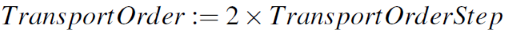
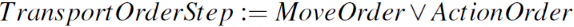
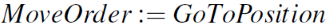
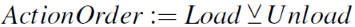

In a manufacturing facility either machines, humans or in a collaborated way are manipulating materials. We assume that the stock of materials is not infinite and a refill of materials is required. Hence our focus in this proposed solution is the supply of new goods. What we should mention is that the scope of LoTLan is the  focus of the transportation of containers and not break bulk cargo. This does not exclude transportation of break bulk cargo within a container like a small load carrier (SLC) or placed on a Euro pallet.

Based on this assumption we define an atomic operation for the transportation of goods for the intra logistics, as follows:

<!-- $$ TransportOrder :=  2 \times TransportOrderStep $$ -->

A TransportOrder (TO) is a task, to move goods from a specific source to a dedicated destination in a determined point in time [1]. This TO is atomic in the way, that once the TO has been started it cannot be interrupted by another TO. This TO needs to be finished before another TO can be executed. 
This does not affect the safety of a human who might operate within the same area. The AGV is responsible for safety. Humans are also able to override the system at any time. The TO consists of two TransportOrderSteps, defining the pickup and the delivery, as follows:

<!-- $$ TransportOrderStep :=  MoveOrder \lor ActionOrder $$ -->

A *TransportOrderStep* (TOS) is a fragment that contains a *MoveOrder or (logicially) an *ActionOrder* which helps to describe either the pickup or the delivery.  It is possible that a *MoveOrder* is not required. This would be the case for example, if the next pickup location is the same as the last delivery location. Therefore we need to describe the *MoveOrder* and an *ActionOrder* as described below.

<!-- $$ MoveOrder :=  GoTo Position	$$ -->

We define a *MoveOrder* by the movement of a current position/location to a specific destination, independently if it is a human or a AGV. 

<!-- $$	ActionOrder :=  Load \veebar Unload	$$ -->

The action can be exclusively either a manual/ automatic loading or unloading of the AGV. 
Based on the atomic operation of a *TO*, further operation could be later introduced, like a *Transloading*. A *Transloading* can be performed by using two *Transports* in a storage facility with sufficient space, like a warehouse.

### References
1. M. ten Hompel and V. Heidenblut, Taschenlexikon Logistik: 511
Abk&uuml;rzungen, Definitionen und Erl&auml;uterungen der wichtigsten Begriffe 
aus Materialfluss und Logistik, 3rd ed., ser. VDI-Buch. Berlin, Heidelberg: Springer-Verlag Berlin Heidelberg, 2011. [Online]. Available: 
http://site.ebrary.com/lib/alltitles/docDetail.action?docID=10479045